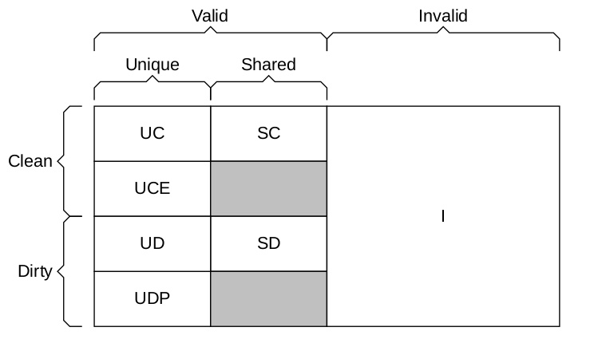
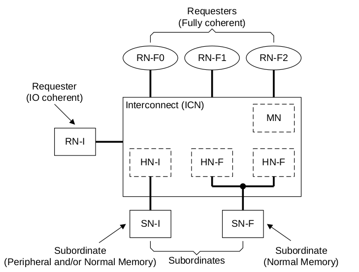

# Architecture overview

[TOC]

## Coherence model

Coherence: write to the same memory location by two components are observed in the same order by all components.

## Cache line state

  

## Component

RN: request node, generate protocol transactions.

1. RN-F: 

    - includes a hardware-coherent cache.
    - Permitted to generate all transactions.
    - Supports all Snoop transactions.

2. RN-D: IO Coherent RN with DVM support.

    - Does not include a hardware-coherent cache.
    - Receives DVM transactions.
    - Generates a subset of transactions.

3. RN-I: IO Coherent RN.
    - No hardware-coherent cache.
    - No DVM.
    - Does not require snoop.

HN: Home Node, located within the interconnect that receives transactions from RN.

1. HN-F: Fully Coherent Home Node.

    - No DVMOp

    - Includes PoC that manages coherency by snooping RN-Fs.

    - PoS that manages order between memory requests.

    - Could include a directory or snoop filter.

2. HN-I: Non-coherent Home Node.

    - No PoC.

    - Not capable of processing snoopable requests.

    - PoS that manages order between IO requests.

3. MN: Miscellaneous Node.

    - receive DVM transaction from RN, completes the required action.

SN: Subordinate Node, receive a request from a HN.

1. SN_F

    - Used for Normal memory.

    - Can process Non-snoopable Read, write and Atomic requests.

2. SN-I

    - peripherals or normal memory.
    - Can process Non-snoopable Read, write and Atomic requests.

  

## Read data source

RN can get data from other RNs, HN and SN. Several techniques can be used to reduce the number of hops to complete a transaction.

1. DMT: SN send data directly to RN
2. DCT: peer RN-F send data directly to the requester.
3. DWT: RN send write data directly to the SN.
