# Transactions

## Transaction Structures

### read transactions

1.  Allocating read
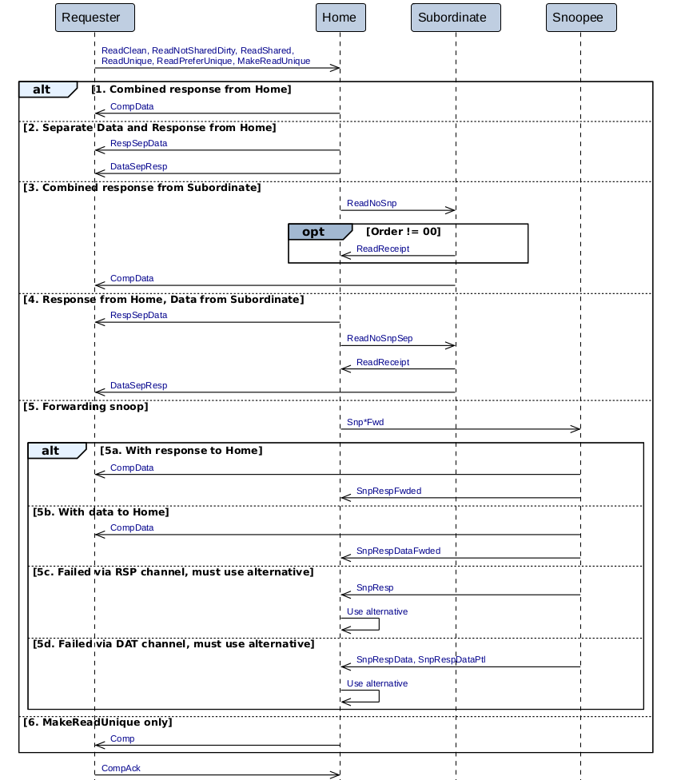

2. non-allocating read
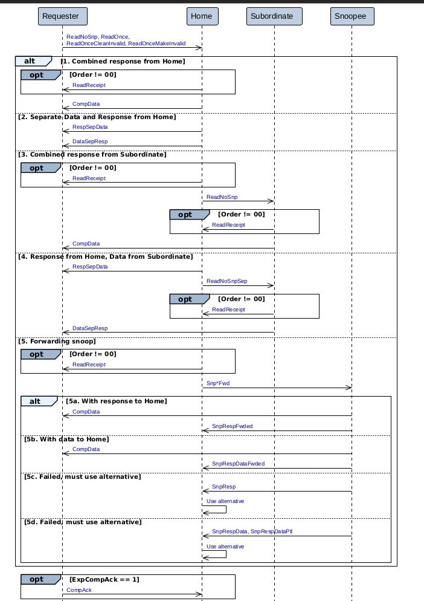

### Write Transaction

1. Immediate Write

    a) DWT
    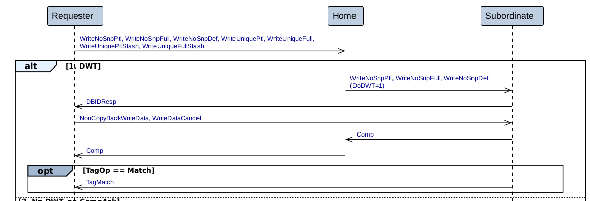
    b) No DWT, no CompAck
    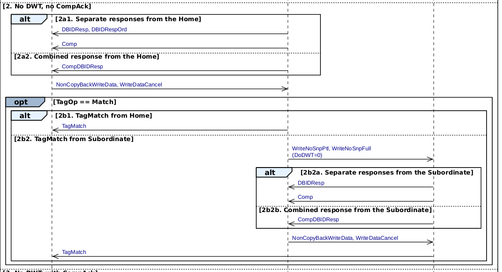
    c) No DWT, with CompAck
    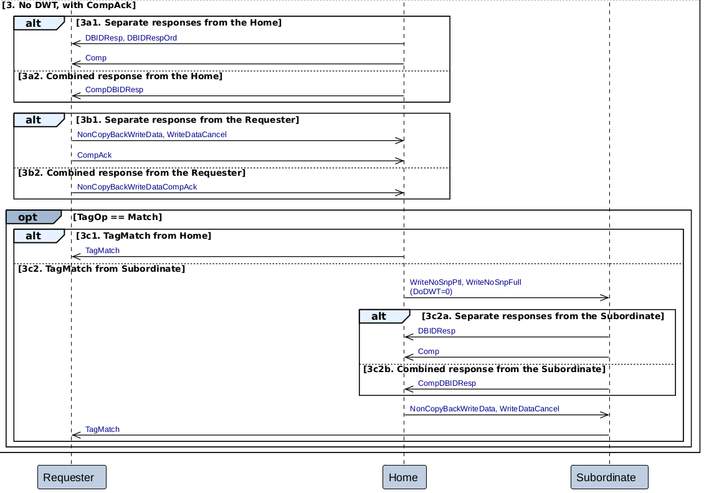

2. Write Zero

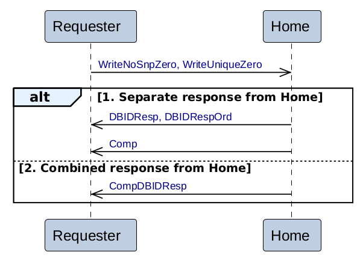

3. Copy Back Write

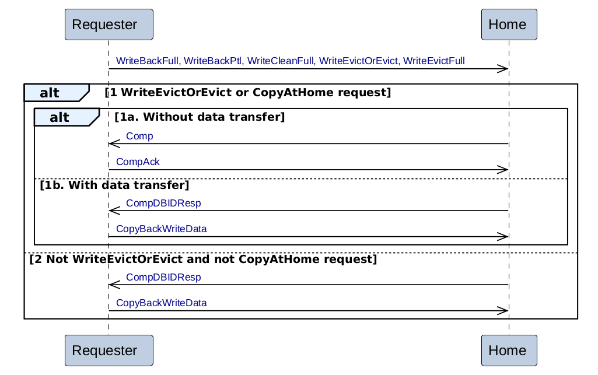

### Atomic transactions

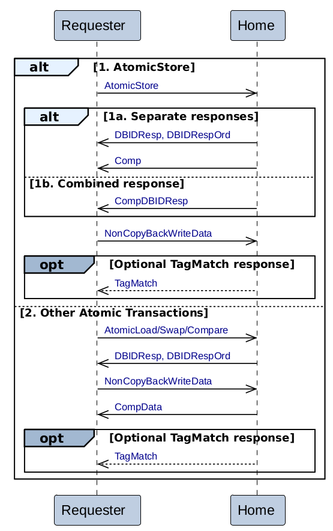

### Stash Transaction

1. Write with Stash Hint
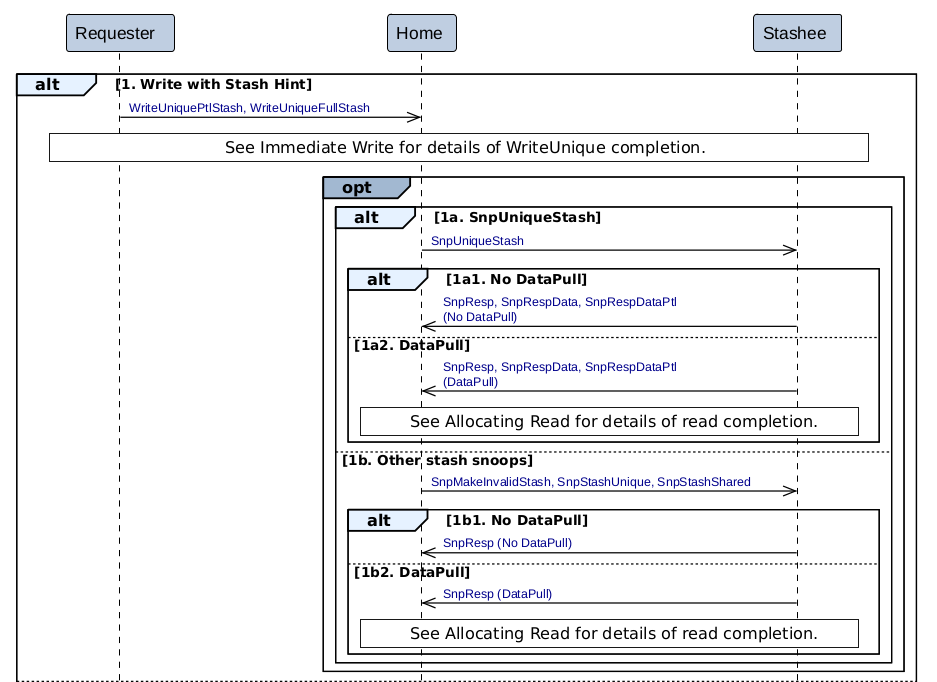
2. Independent Stash without StashDone response
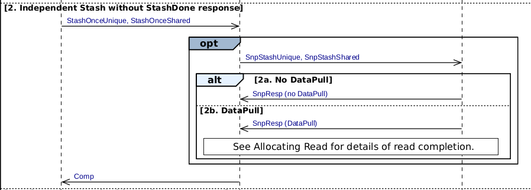
3. Independent Stash with StashDone response
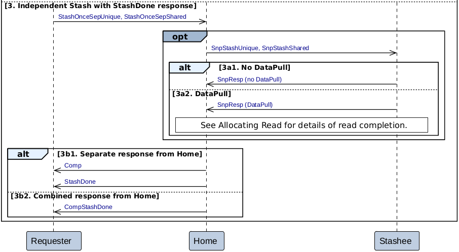

### Dataless Transaction
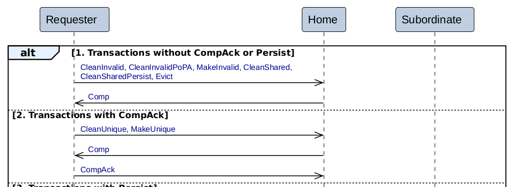

### DVM Transaction
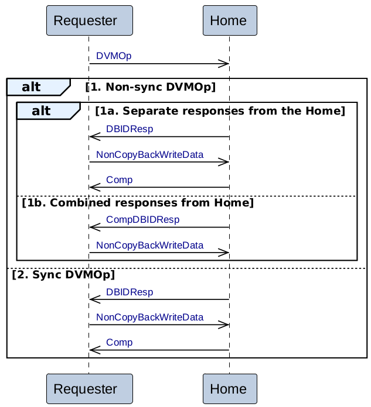

### Retry
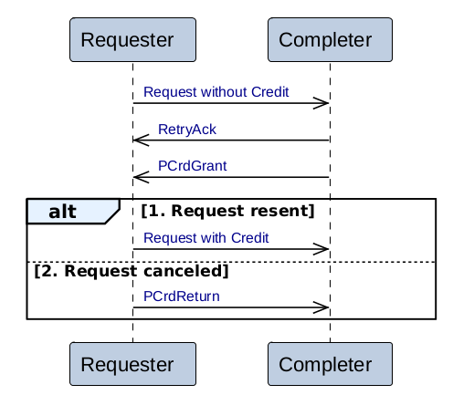

### Home Initiated transactions

1. Read

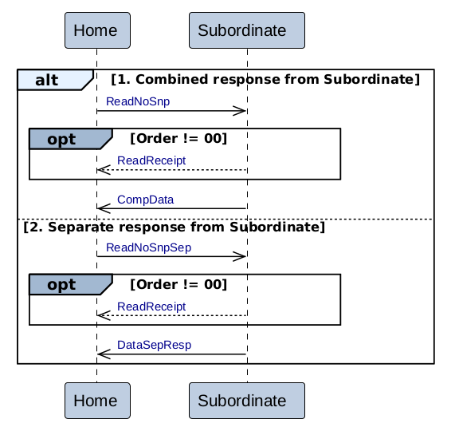

2. Write

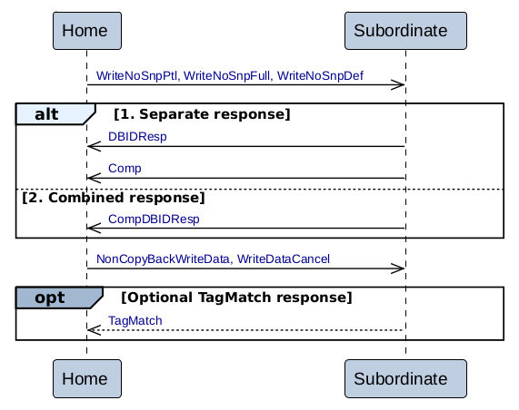

3. Dataless

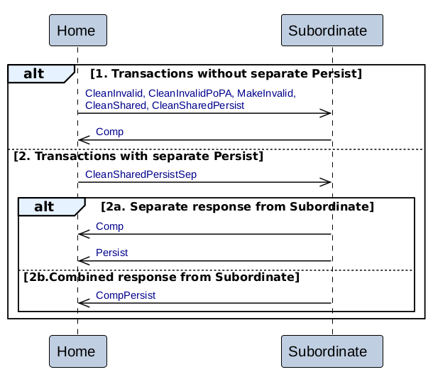

4. Atomic

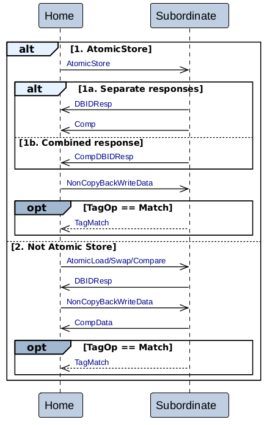

5. Snoopee

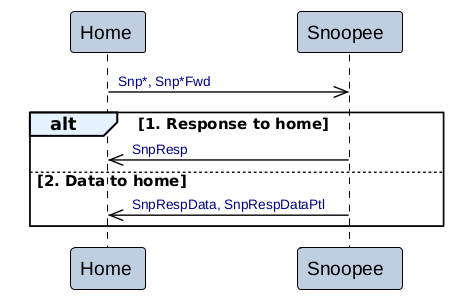

6. DVM

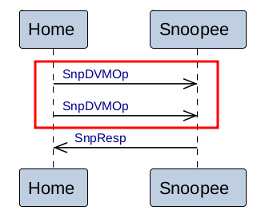