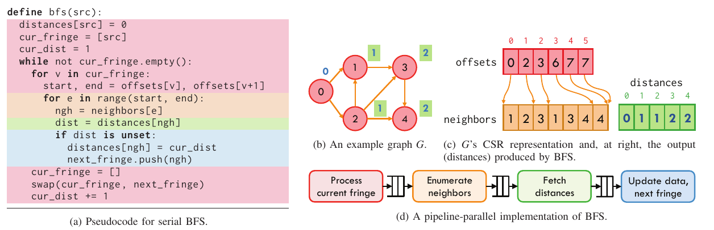
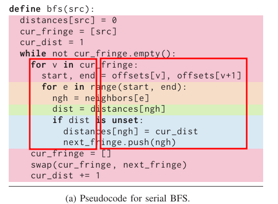
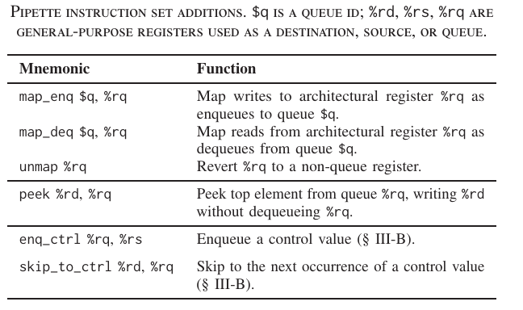
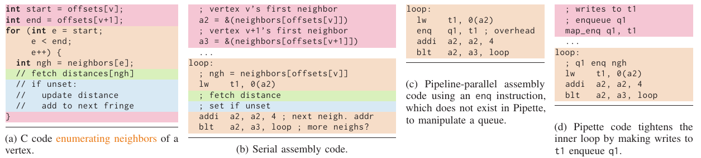
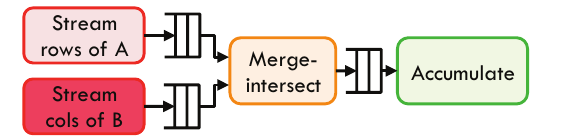
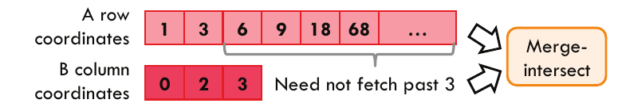
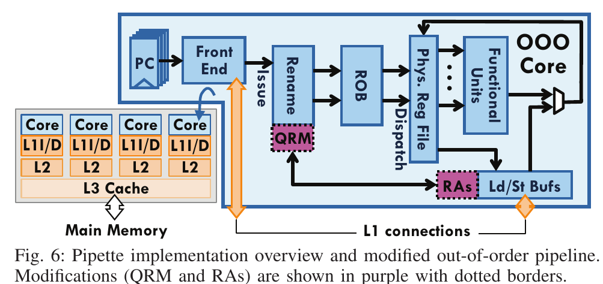
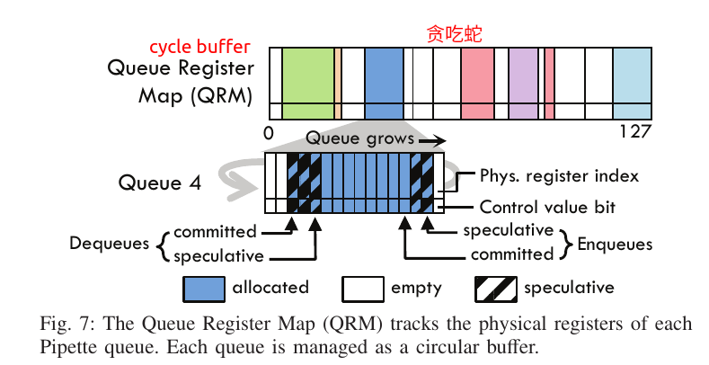

[TOC]

# 1 What does Pipette solve ?

Some applications with irregular memory accesses and control flow, such as graph algorithms and sparse linear algebra, use high-performance cores very poorly.  Instruction latencies cannot hidden by ILP. There are already two solutions, which is **data-parallelism** and **pipeline-parallelism**.

We use BFS to introduce the two solutions.

BFS has three levels of indirection per vertex (i) get vertex's begin and end offset; (ii) get each vertex's neighbors by the begin and end offset; (iii) get neighbors' distance; Each indirection can introduce long latency.

## 1.1 Data parallelism

Data-parallel can allocation vertex to different threads.


Data-parallel suffers from three key problem:

1. Latency are larger than what can be effectively hidden by thread per core. Of course, data-parallelism can split data into many part. There is also a problem to use the core efficiently. If four threads of a core all stalled by finding neighbor's distance, the whole core is stopped.
2. Increase pressure on the memory hierarchy. Update neighbor's distance will introduce many coherence memory access between different threads and cores. And each thread/core need a full core of offset/neighbors/distances array.
3. Overheads because they need to synchronize. After each iterate, we need synchronize between different threads.

## 1.2 Pipeline parallelism

pipeline-parallelism(decoupled architectures) use queues as latency-insensitive interfaces. Pipette and other pipeline-parallel split the program across each long-latency indirection, resulting in four stages. Intra each stage, there is no indirection values access to introduce long latency. Typically, these memory access are sequential and trivially, can be handled by any cache pre-fetcher. However prior decoupled architectures has following problems:

1. Load imbalance as they decouple stages across cores. As above BFS example, <font color=red>Process current fringe</font> stage has less work than other stages. And the last two stages' work depends on the degree of each vertex.
2. Lack control-flow mechanisms to decouple irregular applications. For example, <font color=blue>update data</font> need condition execution.<font color=orange>Enumerate neighbors</font> stage has a variable-length loop.
3. Flexible number of stages. Different application need different number of pipeline stage.

# 2 What is Pipette ?

Pipette introduces ISA to explicitly split pipe stage and add control-flow of each stage. 

Pipette use architecturally visible queues to decouples each stage.

Pipette implement pipeline parallelism within a SMT core. Different stage use one core TDM(Time Division Multiplexing). One thread's stall can be hidden by other threads. There is no load imbalance problem between different cores.

There are some questions:

1. What rules does the Pipette use to split an program into different pipeline stages? Can compiler or some tools help this procedure?
2. How does inter-stage communication work? I know they use queues, but how? And the overheads of the que must be extremely low.
3. What is difference between Pipette SMT core and normal SMT cores in hardware and ISA?
4. Scaling property. When the application need split 10 or more stages. Can this method get speedup properly?

## 2.1 Pipette ISA



### 2.1.1 Low overheads queue

Pipette provides a fixed number of FIFO queues. Each queues's enq/deq operations map to a GPR. Reading this GPR, means deq. Writing means enq. By doing implicit enq/deq, we can save instruction overheads. The <font color=orange>Enumerate neighbors</font> shows Pipette use 3 instructions during each loop. However, explicit enq would use 4 instructions.


### 2.1.2 Control flow

*Control value* use is passed through queue to downstream with the enq_ctrl instruction. With the help of CVs, downstream pipe stage avoid checks for infrequent conditions. Instead, each thread traps into a *dequeue control handler*, when if dequeue a CVs. 
For example the inner loop pipe stage <font color=orange>Enumerate neighbors</font> can change to only one line instruction:

old asm code:
```asm
; old asm code need three instruction
loop:
    lw t1, 0(a2)
    addi a2, a2, 4
    blt a2, a3, loop
```

new asm code with CVs:
```asm
; t0 is the first queue, t1 is the second queue
lw t1, 0(t0)
```
```asm
dequeue_control_handler:
    exit
```

Another example is sparse matrix-matrix multiply.

<font color=red>Stream rows/cols</font> would enqueue a CV, when a row/col terminates. When <font color=orange>Merge itntersect</font> dequeues a CV, it knows currents row/col terminal, the following index is from the next row/col.

Control information can also transfer from consumer to producer with the *skip_to_ctrl* instruction. For consumer, who dispatch this instruction, finds and dequeues the next CV, discarding all earlier data values. If the queue does not have a CV, *skip_to_ctrl* blocks consumers. And the next time the producer attempts an enqueue, producer jumps to an *enqueue control handler* instead.

For example, streaming A's rows is much longer than B's column. When <font color=orange>Merge intersect</font> detects the end of B's column. It would be wasteful for continue stream the current current row's following index. <font color=orange>Merge intersect</font> can use *skip_to_ctrl* to inform the producer A to terminate current row's process.

### 2.1.3 Code transformations to use Pipette

They use a systematic procedure to split applications into Pipette stage manually: split programs along every long-latency indirect load, starting at the innermost loop and moving outwards.

### 2.1.4 Architectural state and context switches

Pipette queues are architectural state, and must be drained and saved across context switches.
When som Pipette's operations must be privileged, OS can provide each process with a set of virtual queues, which it can then map to physical queue ids within each core.

## 2.2 Pipette Micro-architecture



### 2.2.1 physical register-based inter-thread queues

QRM tracks the state of all queues. Each queue takes a contiguous chunk of entries(shown in different colors).

Each entry tracks the physical register index that holds the enqueued value. Moreover, each entry has a control value bit.

Enqueue operation: on issue, the rename stage acquires a free physical register from the freelist, and use it to store the enqueued value. QRM also grows by add the spec enqueue pointer and enqueue the physical register index. ROB stores the previous physical register index. On commit, the ROB does not free the previous physical register index. Instead, the QRM manages it, by adding the committed enqueue pointer.

Dequeue operation: Once dequeue instruction issues, it would check if speculative dequeue pointer is bigger than committed enqueue pointer. If not bigger, get the physical register index from QRM, and add the speculative dequeue pointer. In commit, QRM add the committed dequeue pointer, and returns the register to the freelist. If bigger, the issue would be stalled.

Once mis-speculation happens, the speculative enqueue and dequeue pointers would roll back. Rolling back spec enqueue pointer also release the register to the freelist.

### 2.2.2 reference accelerators

RA is used for accelerate indirect load. Each RA is confiurable unit with a single input queue and output queue. Programers simply see each RA as a separate thread. RA can be configured by specifying which queues to use, and start address A, an element size S, and the access mode(*indirect* or *scan*).

In indirect mode, RA take a stream of indices(i,j,k) from the input queue. Then performs the load operation A[i], A[j], A[k], and puts results to the output queue.

In scan mode, RA take a stream of starting and ending indices from the input queue. Load A[start:end-1] and insert into output queue.

Pipette can performs <font color=green>Fetch instance</font> using a RA thread. And there is no need any software.

### 2.2.3 cross-core queues

Decoupling may require more stages than a core has threads. An application's different pipe stage can distribute to different. Inter-core pipe stage communicate through cross-core queues, which can improve latency and avoid shared-memory synchronization costs. It also let the OS schedule threads individually.

cross-core queues are connectors that stream a queue from producer to consumer. It can be abstract as a separate thread. It uses credit-based flow control.

Intra-core queue: producer->]]]->consumer

Cross-core queue: producer->]]]->connector->]]]->consumer